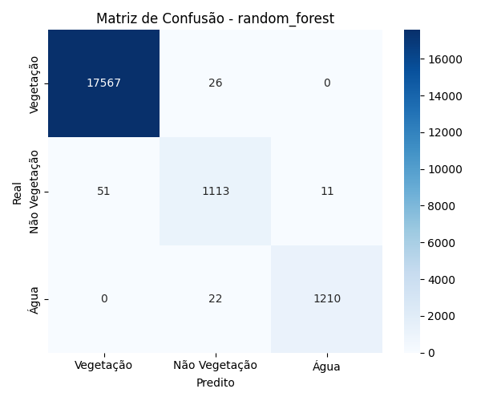
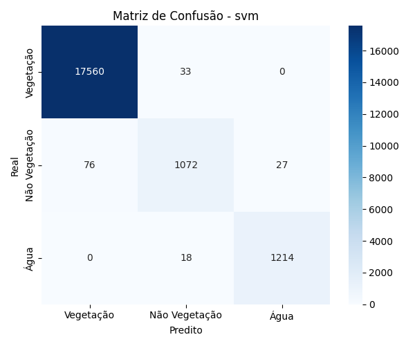
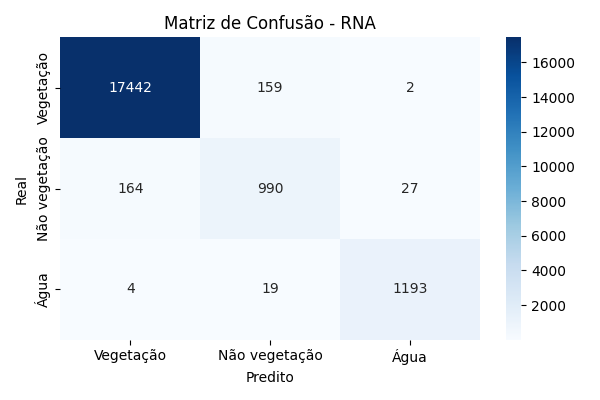

# Classificação de Uso do Solo com Sentinel-2

Este projeto utiliza imagens multiespectrais do satélite Sentinel-2 para classificar automaticamente o uso do solo em quatro categorias:

- 🌿 Vegetação
- 🏜️ Não vegetação
- 💧 Água
- ❓ Não definida (ignorada no treinamento)

## 📂 Estrutura do Projeto

```
classificacao_uso_solo/
├── img_sentinel/         # Imagens .jp2 do Sentinel-2
├── scripts/              # Scripts de processamento e modelos
├── resultados/           # Saída dos classificadores
├── main.py               # Execução principal (SVM/RF)
├── main_rna.py           # Execução principal da CNN
├── requirements.txt      # Dependências
└── README.md             # Este arquivo
```

## 🚀 Como executar

```bash
# 1. Crie o ambiente virtual
python -m venv venv
source venv/bin/activate  # ou venv\Scripts\activate no Windows

# 2. Instale as dependências
pip install -r requirements.txt

# 3. Execute os scripts
python main.py       # Para Random Forest e SVM
python main_rna.py   # Para CNN (Rede Neural)
```

## 🧪 Pré-processamento

- Bandas utilizadas:
  - B01, B02, B03, B04, B05, B06, B07, B8A, B11, B12 (exceto B8, B9, B10)
- Operações aplicadas:
  - Normalização das bandas para o intervalo [0, 1]
  - Alinhamento espacial com a máscara SCL (Scene Classification Layer)
  - Extração de vetores espectrais por pixel e geração de patches (32x32) para RNA
  - Amostragem aleatória de 100.000 amostras para economia de memória

## 📊 Dados

- Total de amostras válidas: ~29.594.170 pixels
- Amostras utilizadas para treino e avaliação:
  - Treinamento: 80.000 patches
  - Validação/Teste: 20.000 patches

## 🧠 Modelos Treinados

### 🎯 Random Forest

- Arquivo: `resultados/random_forest_model.pkl`
- Relatório: [`random_forest_relatorio.txt`](./resultados/random_forest_relatorio.txt)
- Matriz de Confusão:  
  

### 🎯 SVM

- Arquivo: `resultados/svm_model.pkl`
- Relatório: [`svm_relatorio.txt`](./resultados/svm_relatorio.txt)
- Matriz de Confusão:  
  

### 🧠 Rede Neural Convolucional (CNN)

- Script: `scripts/modelo_rna.py`
- Arquivo: `resultados/modelo_rna.pth`
- Relatório: [`rna_relatorio.txt`](./resultados/rna_relatorio.txt)
- Matriz de Confusão:  
  
- Estratégias adotadas:
  - Rede convolucional com duas camadas Conv2D + MaxPool
  - Dropout para regularização
  - Early stopping (paciente: 3 épocas)
  - Treinamento com Adam, CrossEntropyLoss
  - Patches 32x32 com 10 bandas de entrada

## 📈 Métricas Avaliadas

- **Acurácia**
- **Precisão**
- **Revocação**
- **F1-Score**
- **Matriz de Confusão (visual e textual)**

## 📚 Próximos Passos

- Testar diferentes arquiteturas de CNN
- Aplicar pós-processamento espacial
- Avaliar desempenho sobre outras regiões com diferentes índices de vegetação

---

Desenvolvido para fins educacionais e experimentais 🌱
